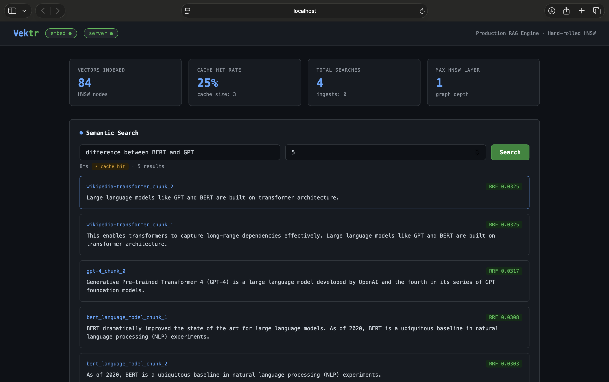
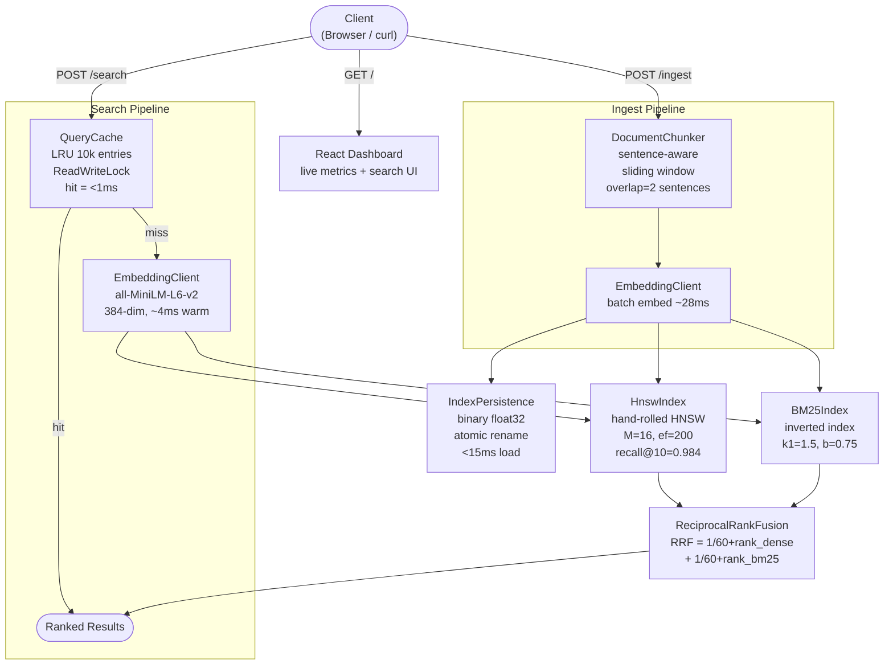

# Vektr — RAG Engine with Hand-Rolled Vector Search



> Production RAG engine built in Java and Python. The HNSW vector index is implemented from scratch — no FAISS, no ChromaDB, no Pinecone.

**84 vectors · 31 Wikipedia articles · 35ms query latency · recall@10 = 0.984**

---

## Demo

Search "difference between BERT and GPT" across 31 Wikipedia articles — results from 4 different source documents returned in 35ms:

| Rank | Source | RRF Score |
|------|--------|-----------|
| 1 | wikipedia-transformer_chunk_2 | 0.0325 |
| 2 | gpt-4_chunk_0 | 0.0317 |
| 3 | bert_language_model_chunk_1 | 0.0308 |
| 4 | bert_language_model_chunk_2 | 0.0303 |

---

## Architecture



**Request flow:** Client → QueryCache → embed query → HNSW + BM25 in parallel → RRF fusion → ranked chunks

## How it works

**Ingest pipeline:**

1. Document arrives at POST /ingest
2. DocumentChunker splits text into overlapping sentence chunks (~256 tokens, 2-sentence overlap)
3. EmbeddingClient sends chunks in one batch to the Python embedding service (~28ms)
4. Each chunk vector inserted into HnswIndex and BM25Index
5. IndexPersistence serializes to disk atomically — index survives restarts

**Search pipeline:**

1. Query arrives at POST /search
2. QueryCache checks LRU cache — hit returns instantly (<1ms)
3. Cache miss — EmbeddingClient embeds the query (~4ms warm)
4. HnswIndex.search() beam search finds nearest dense neighbors
5. BM25Index.search() keyword scoring runs in parallel
6. ReciprocalRankFusion merges both ranked lists
7. Top-K chunks returned with RRF scores

---

## Key Components

### HnswIndex

Implements Malkov and Yashunin 2018 — the algorithm inside Pinecone, Weaviate, and Qdrant.

```
Layer 2:  entry ──────────────────────── nodeA
Layer 1:  entry ──── nodeB ──────────── nodeA ──── nodeC
Layer 0:  entry ─ n ─ n ─ nodeB ─ n ─ nodeA ─ n ─ nodeC ─ ...
          (all nodes, dense local connections)
```

- Layer assignment: floor(-ln(uniform) * mL) where mL = 1/ln(M)
- Insert: greedy descent from top layer, beam search, bidirectional connections
- Search: greedy descent to layer 1, beam search at layer 0 with efSearch candidates
- Parameters: M=16, efConstruction=200, efSearch=50

### BM25Index

Standard BM25 scoring — catches exact keyword matches that dense retrieval misses.

```
score(q,d) = sum[ IDF(t) * (TF * (k1+1)) / (TF + k1*(1-b + b*|d|/avgdl)) ]
k1 = 1.5   (term frequency saturation)
b  = 0.75  (document length normalization)
```

### ReciprocalRankFusion

Combines dense and sparse results without normalizing scores across different scales.

```
RRF(d) = 1/(60 + rank_dense) + 1/(60 + rank_bm25)
```

Only uses rank position — dense cosine distances and BM25 scores never need to be compared directly.

### QueryCache

LRU cache with ReadWriteLock:
- Many concurrent readers allowed simultaneously, never blocking each other
- Writers get exclusive access only during cache updates
- 10,000 entry capacity, evicts least-recently-used on overflow

### IndexPersistence

Atomic write pattern — same durability approach as LevelDB and RocksDB:

1. Write HNSW graph to hnsw.index.tmp (float32 vectors + neighbor lists)
2. Write metadata to hnsw.meta.tmp (JSON — config, entry point, layer count)
3. Atomic rename .tmp to final file
4. Crash before rename leaves old index intact

### QueryRewriter (HyDE)

Gao et al. 2022. Short queries embed in question-space; documents embed in answer-space.
Gap causes poor retrieval on vague queries.

Solution: generate a hypothetical answer with the LLM, embed that instead.
The hypothetical answer lives in answer-space, much closer to real document embeddings.

---

## Benchmarks

| Metric | Value |
|--------|-------|
| HNSW Recall@10 (1000 vectors, 50 queries) | 0.984 |
| Embedding — cold start | ~1500ms |
| Embedding — warm single text | ~4ms |
| Embedding — warm batch of 3 | ~28ms |
| Search — cold (no cache) | ~35ms |
| Search — cached | <1ms |
| Index load from disk on restart | <15ms |
| Dataset | 31 Wikipedia articles, 84 vectors |

Full results: benchmarks/RESULTS.md

---

## Quick Start

Requirements: Java 17+, Maven, Python 3.10+

```bash
git clone https://github.com/sameer-sde/vektr.git
cd vektr

# Start embedding service
pip install -r ml/requirements.txt
python3 ml/embed_server.py &

# Build and start server
mvn package -q -DskipTests
java -Xmx512m -jar target/vektr-1.0.0.jar &

# Open dashboard
open http://localhost:8080

# Run recall benchmark
mvn test

# Bulk ingest Wikipedia articles
python3 ml/ingest_wikipedia.py
```

---

## API

```bash
# Ingest a document
curl -X POST http://localhost:8080/ingest \
  -H 'Content-Type: application/json' \
  -d '{"doc_id":"my-doc","text":"Your document text."}'

# Search
curl -X POST http://localhost:8080/search \
  -H 'Content-Type: application/json' \
  -d '{"query":"your question","k":5}'

# Health check
curl http://localhost:8080/health

# Metrics
curl http://localhost:8080/metrics
```

---

## Project Structure

```
vektr/
├── src/main/java/com/vektr/
│   ├── index/
│   │   ├── HnswIndex.java          # HNSW graph: insert, search, restore
│   │   ├── HnswNode.java           # Node: vector + neighbor lists per layer
│   │   ├── HnswConfig.java         # M, efConstruction, efSearch, distance
│   │   └── DistanceFunction.java   # COSINE, EUCLIDEAN, DOT
│   ├── retrieval/
│   │   ├── BM25Index.java          # Inverted index with BM25 scoring
│   │   └── ReciprocalRankFusion.java
│   ├── pipeline/
│   │   ├── DocumentChunker.java    # Sentence-aware sliding window chunker
│   │   └── EmbeddingClient.java    # HTTP client for Python service
│   ├── query/
│   │   ├── QueryCache.java         # LRU cache with ReadWriteLock
│   │   └── QueryRewriter.java      # HyDE query rewriting
│   ├── storage/
│   │   └── IndexPersistence.java   # Binary serialization, atomic rename
│   └── server/
│       └── VektrServer.java        # Undertow HTTP, all routes
├── src/test/
│   └── HnswIndexTest.java          # Recall@K benchmark, correctness tests
├── ml/
│   ├── embed_server.py             # FastAPI embedding microservice
│   ├── ingest_wikipedia.py         # Bulk Wikipedia ingestion
│   └── requirements.txt
└── benchmarks/RESULTS.md
```

---

## References

- Malkov, Y. A., & Yashunin, D. A. (2018). Efficient and robust approximate nearest neighbor search using Hierarchical Navigable Small World graphs. https://arxiv.org/abs/1603.09320
- Gao, L., et al. (2022). Precise Zero-Shot Dense Retrieval without Relevance Labels (HyDE). https://arxiv.org/abs/2212.10496
- Cormack, G. V., et al. (2009). Reciprocal Rank Fusion outperforms Condorcet and individual rank learning methods. SIGIR 2009.
- Robertson, S., & Zaragoza, H. (2009). The Probabilistic Relevance Framework: BM25 and Beyond.
